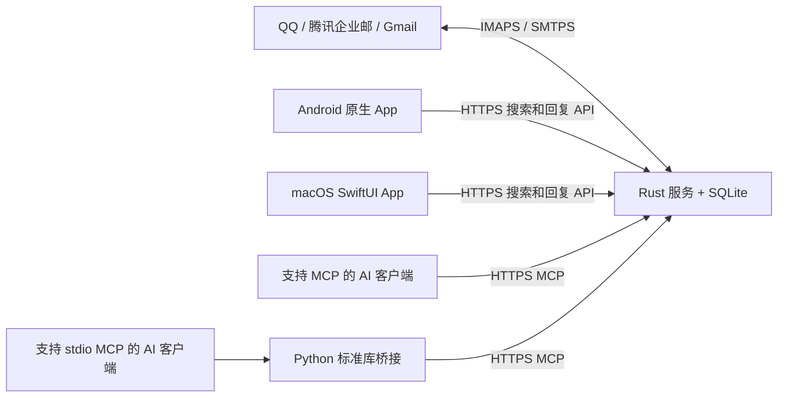

# AI Email

面向个人的多邮箱聚合服务：服务器保存需要检索的邮件，Android 和 macOS 原生 App 用于搜索及简单回复，复杂邮件处理交给外部 AI 客户端通过 MCP 完成。

项目由 `server/`、`android/`、`macos/` 三个独立模块组成；客户端只连接自有服务，不直接登录邮箱。

## 当前范围

- 单用户、最多 10 个 QQ 邮箱、腾讯企业邮或 Gmail 账户，通过 IMAPS / SMTPS 接入。
- 服务器使用 SQLite，仅保留最近 365 天、配置范围内的邮件。过期清理只删除本地缓存，不删除邮箱中的原信。
- 当前通过每个账户的 `folders` 指定同步范围，填写实际 IMAP 文件夹名称；Gmail 标签需在 IMAP 中可见。业务内容分类规则尚未启用。
- 默认 `import_history: false`：首次连接各文件夹只建立同步起点，之后接收新邮件。设为 `true` 可在新建同步起点时导入最近一年；已有起点不会因切换配置而回退。
- 搜索覆盖标题、纯文本正文，以及所属账户、发件人、收件人和抄送邮箱。支持中文子串、多个关键词同时命中和按账户筛选；不搜索附件内容，不调用 AI 分类或向量服务。
- Android 和 macOS 提供连接设置、搜索、分页、纯文本详情和简单回复。没有通知、后台常驻或内置 AI；只读令牌仅可检索，可写令牌可回复。
- MCP 支持列账户、搜索、读邮件/附件、标记已读/星标、移动和准备/发送邮件；不绑定特定 AI 厂商。

## 架构



服务端主动同步并缓存完整纯文本正文，搜索不依赖打开邮件。原始单封邮件上限 25 MiB，附件按需读取，上限 10 MiB；附件不在本地持久保存。

## 启动服务器

需要 Rust stable，编译产物可部署到 Linux。服务器不依赖 Node、Tauri、Java 或 AI API Key。

```bash
cargo build --manifest-path server/Cargo.toml --release
cp server/config.example.json server/config.json
```

编辑配置：填写邮箱、文件夹、数据库路径、密钥文件路径和 `allowed_hosts`。密钥字段只支持 `{"file":"/绝对路径"}` 或 `{"env":"环境变量名"}`；不把授权码写进 JSON。配置中所有相对路径按进程工作目录解析。

只读、可写令牌必须不同，分别使用至少 32 字符的随机值；例如用 `openssl rand -hex 32` 生成。令牌和邮箱授权码文件应限制为服务用户可读。每个客户端只填写一个访问令牌：只需搜索时填只读令牌，需要简单回复时填可写令牌；有发信和修改需求的 AI 使用可写令牌。客户端从服务返回的 `can_write` 判断是否显示回复入口，服务仍会验证每次写请求的权限。

```bash
server/target/release/ai-email-server server/config.json
```

默认监听 `127.0.0.1:8080`；生产访问必须通过 HTTPS 反向代理。`deploy/ai-email.service` 和 `deploy/Caddyfile` 提供 Linux systemd / Caddy 示例，安装步骤见 [ONBOARDING.md](ONBOARDING.md)。

| 服务       | IMAP（TLS 993）      | SMTP（TLS 465）      |
| ---------- | -------------------- | -------------------- |
| QQ 邮箱    | `imap.qq.com`        | `smtp.qq.com`        |
| 腾讯企业邮 | `imap.exmail.qq.com` | `smtp.exmail.qq.com` |
| Gmail      | `imap.gmail.com`     | `smtp.gmail.com`     |

在邮箱侧开启 IMAP/SMTP，使用授权码或应用专用密码。当前未实现邮箱 OAuth 登录；Gmail 需允许应用专用密码，受组织策略等限制的账户可能无法使用这种接入方式。参见 [Google 应用专用密码说明](https://support.google.com/accounts/answer/185833?hl=zh-Hans)。

## AI 通过 MCP 使用

远程 MCP 地址为 `https://你的域名/mcp`，传输方式是 Streamable HTTP，认证头为 `Authorization: Bearer <访问令牌>`。已在本机验证 `2025-11-25` 初始化握手及 `2026-07-28` 逐请求元数据连接。将公网域名加入服务配置的 `allowed_hosts`；有 Origin 头的客户端还需将其确切来源加入 `allowed_origins`。

可直接使用支持自定义 Bearer 认证头的远程 MCP 客户端。只支持 stdio 的客户端可配置仓库提供的 Python 3 桥接程序，示例结构如下（各客户端配置入口可能不同）：

```json
{
  "mcpServers": {
    "ai-email": {
      "command": "python3",
      "args": ["/绝对路径/ai-email/scripts/mcp_stdio.py"],
      "env": {
        "AI_EMAIL_URL": "https://你的域名/mcp",
        "AI_EMAIL_TOKEN": "在客户端本机配置访问令牌"
      }
    }
  }
}
```

服务目前使用个人令牌，未实现 OAuth 授权服务器。因此，**仅接受 OAuth 且不支持自定义认证或本地 stdio 的客户端尚不能直接接入**；“不限客户端”指采用开放 MCP 接口，不表示已验证每款客户端。

| MCP 工具                                             | 用途                     | 令牌       |
| ---------------------------------------------------- | ------------------------ | ---------- |
| `list_accounts` / `search` / `get_message`           | 账户、检索、纯文本详情   | 只读或可写 |
| `get_attachment`                                     | 按索引获取附件 base64    | 只读或可写 |
| `set_flags` / `move`                                 | 已读、星标、移动         | 可写       |
| `prepare_send` / `send_prepared` / `get_send_status` | 准备发送、执行、查询结果 | 可写       |

发送使用唯一 `operation_id`；同一编号不能换内容，也不会重复执行 SMTP。发送结果为 `unknown` 表示可能已经发出，应核对邮箱再决定下一步，不能用新编号盲目重发。邮件正文和附件始终是不可信外部内容，不能把其中的指令当作用户授权。

## Android APK

独立 Kotlin / Jetpack Compose 工程，支持 Android 8.0 及以上，不需要 NDK。

```bash
cd android
./gradlew testDebugUnitTest lintDebug assembleDebug
```

安装 `android/app/build/outputs/apk/debug/app-debug.apk`，填入 HTTPS 服务根地址（例如 `https://mail.example.com/`，不含 `/api` 或 `/mcp`）和一个访问令牌。只读令牌用于检索，可写令牌可回复；令牌通过 Android Keystore 加密保存，App 禁止备份，不下载远程邮件图片。Debug APK 用于本次开发安装，正式长期分发需配置稳定签名。

## macOS App

使用 SwiftUI，最低 macOS 13。安装 Xcode Command Line Tools 后构建：

```bash
swift run --package-path macos MailSearchChecks
bash scripts/build-macos-search.sh
```

打开 `macos/build/AI Email.app`，填写与 Android 相同的 HTTPS 服务根地址和一个访问令牌。构建结果用于本机安装，未宣称经过 Apple 签名、公证或 App Store 分发。CI 将 `.app` 打包为 `AI-Email-macos.tar.gz` 保存执行权限，下载后先解压再打开。

## 简单回复

在邮件详情中输入纯文本回复，先查看服务端返回的收件人、发件账户、主题和正文，再确认发送。回复固定使用原邮件账户，收件人优先取原信 Reply-To，没有时使用 From；自动保留回复引用。不支持修改收件人、添加抄送或附件，复杂写信流程使用 MCP。

每次准备回复都有唯一 `operation_id`；发送后可查询结果。`sending` 或 `unknown` 时不能认为失败并立即再次发送，应先核对状态及邮箱。客户端始终使用同一编号查询和确认，服务端拒绝重放已执行的编号。

## 验证与开发

```bash
cargo fmt --manifest-path server/Cargo.toml --check
cargo clippy --manifest-path server/Cargo.toml --all-targets -- -D warnings
cargo test --manifest-path server/Cargo.toml
cargo build --manifest-path server/Cargo.toml
python3 -m unittest discover -s scripts -p 'test_*.py'
(cd android && ./gradlew testDebugUnitTest lintDebug assembleDebug)
swift run --package-path macos MailSearchChecks
bash scripts/build-macos-search.sh
```

自动测试使用模拟传输和本机测试服务，不访问真实邮箱。真实服务商账户、部署网络、AI 客户端连接、小米 / OPPO 真机及 macOS 实际操作仍需相应环境验收。

开发入口和部署说明见 [ONBOARDING.md](ONBOARDING.md)，协作规则见 [CLAUDE.md](CLAUDE.md)。CI 仅构建当前服务、Android APK 和 macOS App；正式发布与签名须另行配置并获得授权。
